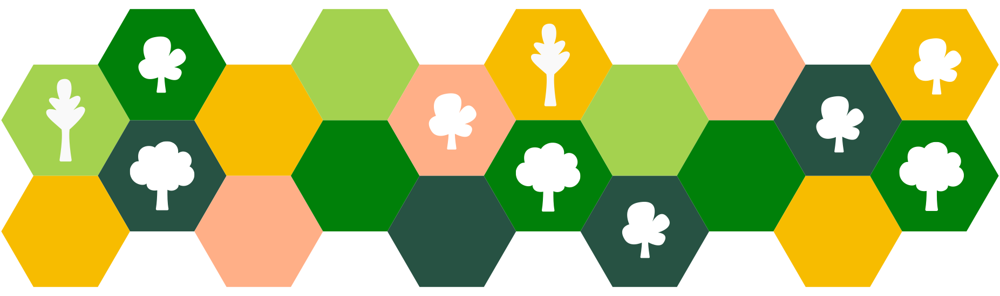

## About

**Ecosia: the board game** is the fun co-op board game that you probably already own!

Based on the popular game about colonialism and resource extraction _Settlers of Catan_, we've re-imagined what living in the island of Catan could be like if humans and nature could co-exist.

This game was developed by a group of board game fans at Ecosia with a multitude of skills, but more importantly a love for trees, nature and the environment. It features a mix of strategy and luck. If you decide to give it a try, we would love to hear back from you over on our Github page.

**Players**: 1-6 (ideally 4) | **Duration**: 30-40 minutes

## Materials needed

Part of the idea of a sustainable board game is to avoid having to buy a new game. We encourage you to repurpose the cards and pieces from Catan and other games, but you can also print our custom-made card deck. To play **Ecosia: the board game** you will need:

* Settlers of Catan basic board
* Number tokens from Catan (2-12)
* Catan's resource cards + knight cards (or print [our tree management deck](https://github.com/gamesfortrees/ecosia-board-game/tree/main/cards))
* A Standard 52-card deck (or print our [event deck](https://github.com/gamesfortrees/ecosia-board-game/tree/main/cards))
* 1 D6 die, or a spinner, to choose a random direction
* 3 sets of at least 15 identical pieces to represent 3 species of trees
* A first-player token (e.g. the robbers token from Catan)
* A small opaque bag to place the numbers (should fit your hand)









## Feedback

We are still play-testing this game, and actively looking for ways to make it more fun and challenging. If you try it out, we would love to hear back from you. The best way to get in contact is via [Github Discussions](https://github.com/gamesfortrees/ecosia-board-game/discussions/2)